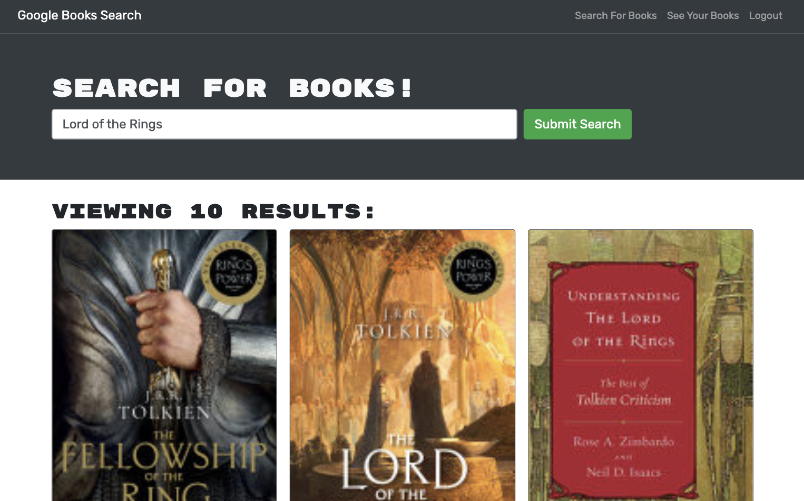

# Google Book Search Engine

## Description
This web application enables users to log in and sign up, search for books, and save or delete books to their account. 

The project's objective was to transform a RESTful API-based Google Books API search engine into a GraphQL API using Apollo Server. This conversion entailed replacing RESTful API with GraphQL queries and mutations for data retrieval and modification, adjusting authentication middleware for compatibility with a GraphQL API, and setting up an Apollo Provider. The biggest challenge was rendering saved books on the user's account, which was resolved with assistance from a second set of eyes. This help revealed errors, such as an extra bracket causing an empty saved books array and an invalid argument passed into a book-saving function, which allowed the project to be completed successfully.

## Table of Contents

- [Installation](#installation)
- [Usage](#usage)
- [Screenshot](#screenshot)
- [Credits](#credits)
- [License](#license)

## Installation

Installation is not required. Please navigate to the deployed site by [clicking this link](https://fd-google-book-search-engine.herokuapp.com/). 

## Usage

1. Open the deployed site 
1. Click the `Login/Sign Up` button on the nav in the top right corner of the screen
1. Sign Up as a new user by entering the required fields
1. In the search bar, type in a book or author you'd like to search for
1. To save a book, find a book you'd like to save, then click the blue `Save this Book!` button
1. To view your saved books, click the `See Your Books` link in the nav on the top right corner of the screen
1. To delete a book from your saved books list, click the `Delete this Book!` button under the saved book

## Screenshot

## Credits

While creating this project, I read documentation on GraphQL, Apollo Server, Apollo Client/Provider, and React.js. Additionally, I recieved feedback and support from my 2U tutor. 

- [React.js](https://reactjs.org/docs/hello-world.html)
- [GraphQL](https://graphql.org/graphql-js/)
- [Apollo Server](https://www.apollographql.com/docs/apollo-server/)
- [Apollo Client](https://www.apollographql.com/docs/react/get-started/#step-1-setup)

## License

[MIT](https://spdx.org/licenses/MIT.html)
